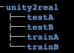
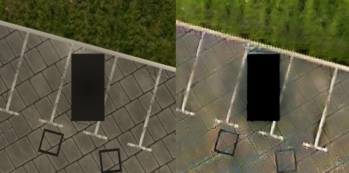
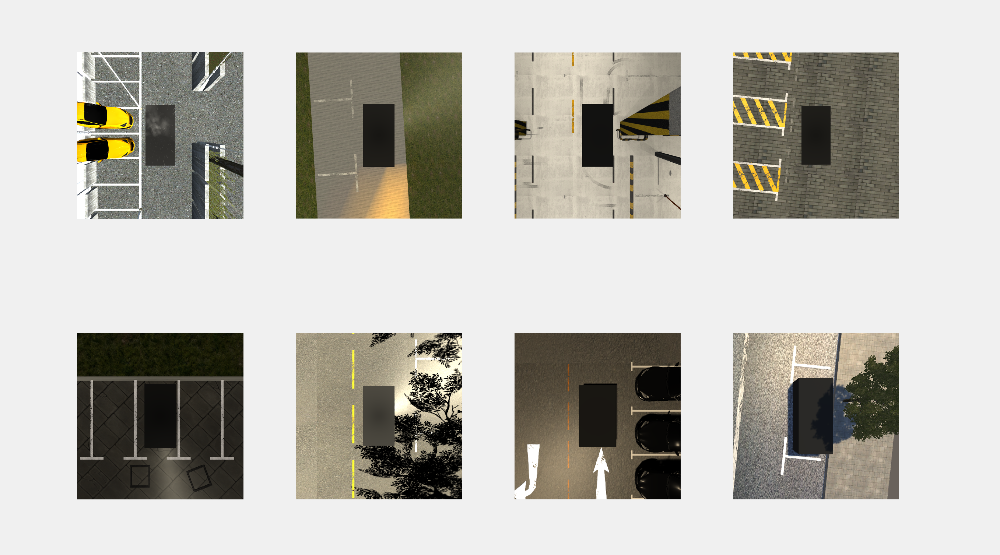
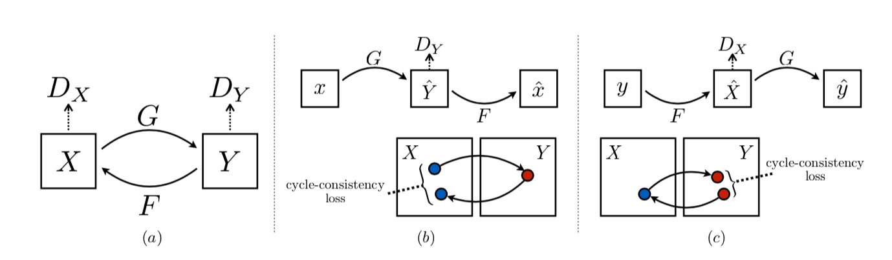
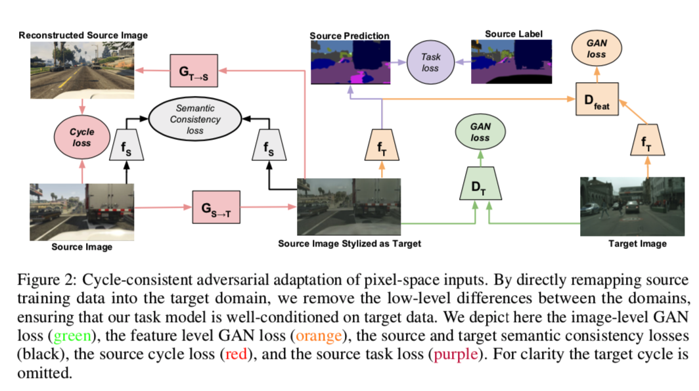
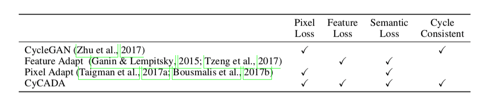
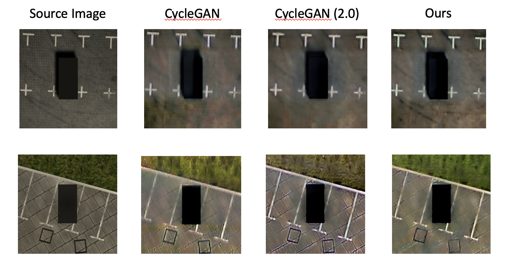

# Computer Vision Final Project

This is the document for the final project  ***Pixel-level domain adaptation: A study case on generating parking-slot image samples*** of Course Computer Vision (42029401), School of Software Engineering, Tongji University.

Unity Scenes are created by @[Pomevak](https://github.com/Pomevak) & @Mei Luo

# 1. How to run this project

### Down dataset

You can download our generated dataset:

Part1: https://pan.baidu.com/s/1kgIA_R4ZqZ7al9UdPX_Cyg , password: mbmp (539M)

Part2: https://pan.baidu.com/s/1k3Cp66aRIrW_m9EeW5tUUA (192M)

Then download the real scene dataset:

https://drive.google.com/open?id=1i1pSnkIRyTgt6kmWr_sN6jrasX2HngWc (2.2G)

You can divide the dataset by yourself, a sample:



### Configure environment

Our project is mainly based on the **[CycleGAN-Tensorflow-2](https://github.com/LynnHo/CycleGAN-Tensorflow-2)** by [@LynnHo](https://github.com/LynnHo), and the prerequisities are the same:

- Ubuntu 16.04 LTS
- Python 3.6
- CUDA 10.0 & cuDNN 7.4
- tensorflow-gpu 2.0.0-alpha0
- tensorflow-addons
- scikit-image, oyaml, tqdm

You can install the python package: `pip install -r requirements.txt`

### Run train and test

You can see all of the input arguments in `train.py` & `test.py`

Train:

```bash
CUDA_VISIBLE_DEVICES=0 python train.py --dataset unity2real
```

Test:

```bash
CUDA_VISIBLE_DEVICES=0 python test.py --experiment_dir ./output/unity2real
```

### Output sample

You can see the output sample at `./output/unity2real/sample_training`



# 2. Introduction

## 2.1 Backgroud

> Domain adaptation is a hot research topic in the fields of machine learning and computer vision. Roughly speaking, methods in this area can be categorized into two classes, pixel-level ones and feature-level ones. Image-level domain adaptation aims to learn the mapping between different visual domains. It is quite useful for augmenting training sets. In this project, your task is to complete a system which can create virtual parking-slot image samples that are realistic looking.


## 2.2 Requirements

> 1. Develop a virtual parking-slot image generation system using Unity. Taking a real road image as the texture. Then, feed the texture into Unity. Your system is expected to create various parking-slot image samples by adjusting the lighting conditions, the trees, the objects nearby, and the  parking-lines.
>
> 
>
> 　
>
> 2. Virtual image samples may be not as real as samples collected from the real world. So, you need to use GAN-based domain adaptation technologies to improve their reality. You may try the following suggested candidate solutions: 1) Learning from simulated and unsupervised images through adversarial training, CVPR 2017; 2) Unsupervised pixel-level domain adaptation with generative adversarial networks, CVPR 2017; 3) Diverse image-to-image translation via disentangled representations, ECCV 2018. To train GAN-based pixel-level domain adaptation networks, you may need to use real parking-slot image samples, which can be obtained here https://cslinzhang.github.io/deepps/.


# 3. Solution

## 3.1 Generate dataset

We use unity to construct some virtual scenes.

According to the requirements, we generated parking space pictures for different scenes.

We mainly classify parking spaces as follows:

1. Lighting: We simulated the changes in lighting under one day, especially in the case of strong light during the day and sunset
2. Weather: sunny, rainy, cloudy, we have made a weather control system to change the weather in one scene.
3. Shade: There may be shade of tree or other tall buildings on the road.
4. Obstacles: cars, pedestrians, manhole covers on the ground, fire rafts, short bushes, street lights, etc.
5. Direction of the parking space: horizontal, lateral, oblique
6. Parking line: solid line, dotted line, different mottled degree
7. Ground texture: cement floor, masonry ground, shallow lawn, mooring road surface, etc.

We mainly set up the following scenarios.




## 3.2 Domain adapation

### CycleGAN[^1]



CycleGAN is a creative network to solve the unpaired pix2pix domain adapation problem.

The innovation of CycleGAN is that it enables this migration between the source and target domains without the need for one-to-one mapping between training data.

In this method, the image in the source domain is transformed by two steps: 

- Map the source image to the target domain

- Returne the generated image in target domain to the source domain,  get the generated image, thus eliminating the requirement of image pairing in the target domain. 

Using the generator network to map the image to the target domain, and by matching the generator and discriminator, the quality of the generated image can be improved.


### CyCADA[^2]



CyCADA is a new network structure based on CycleGAN, which adapts representations at both the pixel-level and feature-level. By adding feature loss & semantic loss, CyCADA can perform better on domain adaptation problem, especially on the dataset with semantic information. And the experiment designed by the authors is a transform from GTA game screenshots to real scene, similar to our project.




### Our network

Since our dataset doesn't have the semantic information, so I just add feature loss to CycleGAN, use resnet as the encoder to extract feature map. Then Compare the features from A domain and regenerated B domain images, I set the initial feature loss weight as 0.2, you can change that to adjust the influence by feature loss. ` --feature_loss_weight`

```python
# module.py
def ResnetEncoder(input_shape=(256, 256, 3),
                    output_channels=3,
                    dim=64,
                    n_downsamplings=2,
                    n_blocks=9,
                    norm='instance_norm'):
    Norm = _get_norm_layer(norm)

    def _residual_block(x):
        dim = x.shape[-1]
        h = x

        h = Pad([[0, 0], [1, 1], [1, 1], [0, 0]], mode='REFLECT')(h)
        h = keras.layers.Conv2D(dim, 3, padding='valid', use_bias=False)(h)
        h = Norm()(h)
        h = keras.layers.ReLU()(h)

        h = Pad([[0, 0], [1, 1], [1, 1], [0, 0]], mode='REFLECT')(h)
        h = keras.layers.Conv2D(dim, 3, padding='valid', use_bias=False)(h)
        h = Norm()(h)

        return keras.layers.add([x, h])

    # 0
    h = inputs = keras.Input(shape=input_shape)

    # 1
    h = Pad([[0, 0], [3, 3], [3, 3], [0, 0]], mode='REFLECT')(h)
    h = keras.layers.Conv2D(dim, 7, padding='valid', use_bias=False)(h)
    h = Norm()(h)
    h = keras.layers.ReLU()(h)

    # 2
    for _ in range(n_downsamplings):
        dim *= 2
        h = keras.layers.Conv2D(dim, 3, strides=2, padding='same', use_bias=False)(h)
        h = Norm()(h)
        h = keras.layers.ReLU()(h)

    # 3
    for _ in range(n_blocks):
        h = _residual_block(h)
    
    h = keras.layers.ReLU()(h)

    return keras.Model(inputs=inputs, outputs=h)
```

```python
# train.py
A2B = G_A2B(A, training=True)
B2A = G_B2A(B, training=True)
A2B2A = G_B2A(A2B, training=True)
B2A2B = G_A2B(B2A, training=True)

G_A_Feature = F_A(A2B, training=True) # Get the feature of generated image from A
B_Feature = F_B(B, training=True) # Get the feature of B image

A2B_d_logits = D_B(A2B, training=True)
B2A_d_logits = D_A(B2A, training=True)

A2B_g_loss = 2*g_loss_fn(A2B_d_logits)
B2A_g_loss = g_loss_fn(B2A_d_logits)
A2B2A_cycle_loss = cycle_loss_fn(A, A2B2A)
B2A2B_cycle_loss = cycle_loss_fn(B, B2A2B)
A2B_id_loss = identity_loss_fn(A, A2B)
B2A_id_loss = identity_loss_fn(B, B2A)
G_A_B_Feature_loss = identity_loss_fn(G_A_Feature, B_Feature) # Calculate the loss between two features

G_loss = (A2B_g_loss + B2A_g_loss) + (A2B2A_cycle_loss + B2A2B_cycle_loss) * args.cycle_loss_weight + (A2B_id_loss + B2A_id_loss) * args.identity_loss_weight + G_A_B_Feature_loss*args.feature_loss_weight
```

**Result**



## 4. References
### CycleGAN

#### Paper:

[^1]: J. Zhu, et al, *[Unpaired Image-to-Image Translation using Cycle-Consistent Adversarial Networks](https://arxiv.org/abs/1703.10593)*, 2017 International Conference on Computer Vision (ICCV 2017), IEEE, 2017.

#### Codes:

https://github.com/LynnHo/CycleGAN-Tensorflow-2

### CyCADA:

#### Paper:

[^2]: J. Hoffman, et al, *[CyCADA: Cycle Consistent Adversarial Domain Adaptation](https://arxiv.org/abs/1703.10593)*, 2018 International Conference on Machine Learning (ICML 2018), IEEE, 2018.

#### Codes:

https://github.com/jhoffman/cycada_release

